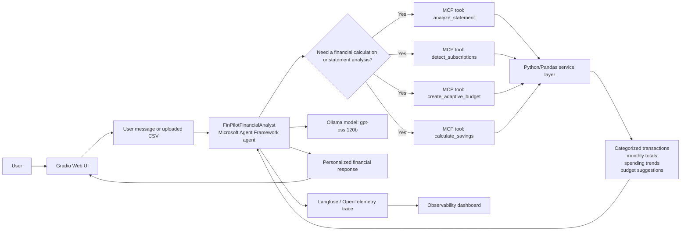

# FinPilot – Agentic AI Personal Finance Assistant

An agentic AI-powered personal finance assistant that analyzes bank statements, identifies spending patterns and recurring subscriptions, creates adaptive budgets, and provides personalized financial guidance using AI and MCP tools.

By Prayansh Pahare | 30 August 2026 | Agentic AI Capstone Project

## 1. Executive Summary

FinPilot is a personal finance assistant that turns raw bank-statement data into understandable financial insight. It accepts uploaded CSV statements, validates the file, categorizes transactions, calculates total income, expenses, savings, and savings rate, and highlights recurring subscriptions and spending patterns. The system also creates adaptive budget recommendations based on historical spending and supports natural-language questions through a conversational finance agent. The major design idea is to combine deterministic financial calculations in Python with a reasoning layer that decides which tool to use and explains the result in plain language.

The project is aimed at everyday users who want to understand where their money goes without manually processing spreadsheets or learning financial analysis methods. The most important findings are that the architecture is effective for tasks requiring both reliability and flexibility, and that the use of MCP tools is a strong pattern for keeping the LLM grounded in verified financial logic rather than guesswork. FinPilot also demonstrates that an agent can be useful when the same user asks different financial questions over time, using the same uploaded statement and the same conversation context.

## 2. Problem and Users

Managing personal finances from bank statements is time-consuming and difficult because users must manually separate income and expenses, categorize transactions, identify recurring charges, estimate savings, and decide whether their current monthly spending is aligned with their target budget. Many users do not want to work with raw CSV files or spreadsheet formulas. They want a simple way to understand their spending patterns and receive actionable guidance without needing financial expertise.

FinPilot addresses this gap by automating the analysis of uploaded statements and turning the result into a conversational, decision-support experience. It is designed for individuals who want a simple way to view transaction trends, evaluate spending habits, detect recurring subscriptions, and understand whether they are meeting a savings goal. This includes students and young professionals, salaried employees, and any user who prefers natural-language interaction over manual spreadsheet analysis. The project is not trying to replace a financial advisor; it is trying to reduce friction for everyday financial awareness and budgeting.

An agent is needed because the system must handle different user intents in natural language. A single calculation script could answer “How much am I saving?”, but it would not decide whether the user needs a statement review, a subscription scan, a budget recommendation, or a plain explanatory answer. The logic for choosing the right tool and explaining the result in context belongs to the agent. The numerical work is intentionally separated into deterministic services so that the LLM can reason without inventing financial totals. This agent-based design makes the system more flexible than a fixed dashboard while still preserving calculation reliability.

## 3. Scope

**In scope**
- CSV bank-statement upload and validation
- Income, expense, savings, and savings-rate calculation
- Rule-based transaction categorization
- Daily spending-trend analysis
- Detection of possible recurring subscriptions
- 50/30/20 and adaptive budget generation
- Budget history comparison and adjustment suggestions
- Conversational question answering through a finance agent
- Gradio web UI and Render deployment support
- Langfuse/OpenTelemetry observability for tracing tool calls and model usage

**Out of scope**
- Direct bank-account integration or live API syncing
- Investment advice or portfolio optimization
- Authentication, user accounts, or multi-user storage
- Production-grade database systems or enterprise security controls
- Advanced ML-based categorization and forecasting
- Real-time financial monitoring across multiple institutions

## 4. Architecture

1. The user uploads a bank statement in the Gradio interface or asks a finance question in the chat panel.
2. The Gradio UI passes the statement path and message to the agent wrapper in the finance agent module.
3. The Microsoft Agent Framework session creates a reusable conversation state so follow-up questions can use prior context.
4. The FinPilotFinancialAnalyst decides whether the query requires a tool call or whether it can answer directly. This is the key reasoning step.
5. When a calculation is needed, the agent invokes the appropriate MCP tool, such as analyze_statement, detect_subscriptions, or create_adaptive_budget.
6. The MCP server calls deterministic Python/Pandas service functions under the services directory to compute totals, categorize transactions, detect subscriptions, or generate budget suggestions.
7. These results are returned to the agent, which interprets the output and converts it into a simple, user-facing answer.
8. The response is shown in the UI, while traces and token-level telemetry are emitted to Langfuse/OpenTelemetry for observability.

This architecture keeps the model from doing unreliable arithmetic while still allowing natural-language financial guidance. The system is modular enough that new tools or services can be added without changing the overall interaction pattern.

## 5. Agent Design

| name | role | tools it may call | when it hands off | how it terminates |
| --- | --- | --- | --- | --- |
| FinPilotFinancialAnalyst | Single reasoning agent for personal finance questions and statement analysis | analyze_statement, detect_subscriptions, create_budget, create_adaptive_budget, adjust_budget, calculate_savings | When the request needs a financial calculation, statement interpretation, budget analysis, or conversational explanation; otherwise it answers directly | Returns a final text response for the current turn and reuses the MAF session for follow-up questions |

The system is intentionally designed around a single runtime agent rather than a multi-agent swarm. This is a deliberate capstone simplification: one agent is enough to interpret user intent, decide which MCP tool is relevant, and summarize the result clearly. The real intelligence is not in a large number of autonomous agents; it is in the clean separation between reasoning and deterministic computation.

The design choices behind this approach are important. The agent is instructed to use financial tools whenever calculations or statement analysis are needed and to avoid inventing numbers. That instruction is critical because the system’s purpose is not to “hallucinate” financial advice, but to ground answers in validated calculations. The same agent also reuses a Microsoft Agent Framework session so follow-up chats can keep context without re-uploading the statement each time.

The agent’s termination behavior is simple and predictable: it responds with a final answer at the end of the user’s request, while the session remains available for later turns. This helps preserve continuity for questions like “How has my spending changed since last month?” or “How do I improve my savings?” without requiring a full reset of the conversation state.

## 6. Data and Knowledge

The project’s primary knowledge is derived from user-supplied bank statement CSV files. The repo contains a sample CSV in data/sample_statement.csv with 30 transactions, covering income and debit entries across three months. The expected required columns are date, description, amount, and type, and the parser validates the file before analysis. The system then normalizes text, converts amounts to numeric values, and applies rule-based categorization to each transaction using the available service logic.

The app also uses a local budget history JSON file to store previous budget states for comparison and adjustment. In the current repository, that file exists, but the exact number of saved budget entries is not defined in the code as a fixed count. The system stores the latest budget and compares it against the previous saved version when calling the budget adjustment logic.

The distinction between prompt knowledge and runtime knowledge is deliberate. The system prompt in the finance agent provides the behavioral constraints: use tools when calculations are needed, do not invent financial numbers, explain in simple language, and treat detected subscriptions as possible expenses rather than confirmed waste. The actual financial facts are retrieved at runtime from uploaded statements, service calculations, and the relevant MCP tool outputs. This reduces the chance that the model will “guess” totals while still allowing contextual explanation and user-friendly conversation.

## 7. Implementation

The stack is built around Python 3.12 and uses Microsoft Agent Framework for agent orchestration, Ollama for model hosting, and Model Context Protocol for tool access. The runtime environment is declared in pyproject.toml and includes agent-framework, agent-framework-ollama, gradio, langfuse, mcp[cli], pandas, plotly, openpyxl, and opentelemetry-sdk. The configured model in the environment example is gpt-oss:120b via Ollama, and the UI is a Gradio app. Observability is covered by OpenTelemetry and Langfuse traces.

The three most significant technical decisions were:

1. Deterministic calculations behind the agent. The project does not ask the model to compute totals directly. Instead, financial logic lives in Python/Pandas service functions and is exposed through MCP tools. The rejected alternative was an LLM-only calculation strategy, which was rejected because it could make up numbers or mis-handle financial totals.
2. A single-agent architecture with MCP tools. The project uses one Finance Agent and a standardized tool layer rather than a multi-agent design. The rejected alternative was a multi-agent architecture, which was rejected for capstone simplicity and because it would add coordination complexity without improving the core problem-solving pattern.
3. A modular service layer with observability. The project separates statement parsing, categorization, subscriptions, trends, adaptive budgeting, and UI concerns across service modules and traces agent/tool execution. The rejected alternative was tightly coupled logic inside the UI or agent code, which was rejected because it would be harder to test, debug, and extend.

## 8. Evaluation

No formal benchmark-style evaluation was run for the project. The evaluation that did occur was functional, manual, and demo-oriented. The dataset included one synthetic sample bank statement with 30 transactions, stored in data/sample_statement.csv. The test cases were manually designed: 13 functional cases covered statement analysis, subscription detection, AI queries, transaction categorization, savings calculations, spending trends, adaptive budgeting, invalid input handling, session memory, and MCP tool invocation.

The evaluation slices were feature/workflow based rather than statistical or demographic: statement parsing, savings logic, adaptive budget logic, chat behavior, and error handling were each checked separately. Metrics were mainly functional correctness: whether the calculations matched expected values, whether the correct MCP tool was invoked, whether the agent explained results clearly, and whether invalid input produced a readable error instead of crashing. Scoring was a manual pass/fail check; there was no accuracy, F1, or LLM-as-judge scoring framework in the repo.

The number of runs was not fixed or recorded as a formal benchmark. In other words, the project demonstrates working flows and demo validation, but not a repeatable evaluation harness with repeated runs across a defined set of cases. That is a real limitation and should be noted in the results.

## 9. Results

| Metric | Value |
| --- | --- |
| Agent trace latency | ~2.69 seconds |
| LLM Call 1 latency | 1.12s |
| LLM Call 1 input tokens | 458 |
| LLM Call 1 output tokens | 58 |
| LLM Call 1 total tokens | 516 |
| LLM Call 2 latency | 1.57s |
| LLM Call 2 input tokens | 564 |
| LLM Call 2 output tokens | 125 |
| LLM Call 2 total tokens | 689 |
| Total LLM tokens | 1,205 |
| Tool execution time | ~0.00s |
| Quality score | not measured |
| Monetary cost | not measured |

These values were captured from real Langfuse traces during execution. The latency and token measurements are therefore grounded in actual usage data, while the quality and cost dimensions remain unmeasured. The project does demonstrate a working end-to-end flow in which the agent, MCP tool, and service layer cooperate to produce a response, but it does not yet include formal quality scoring or cost accounting.

Gaps: Formal benchmark dataset, repeated-run evaluation, quality scoring, cost measurement, production security testing, and multi-user validation are not measured. The repository includes a single synthetic sample statement and manual functional validation, but it does not provide a standardized evaluation suite or a measured outcome across a broad user or transaction set.
